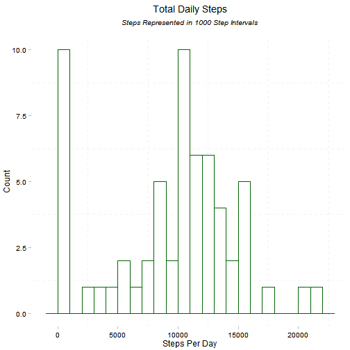
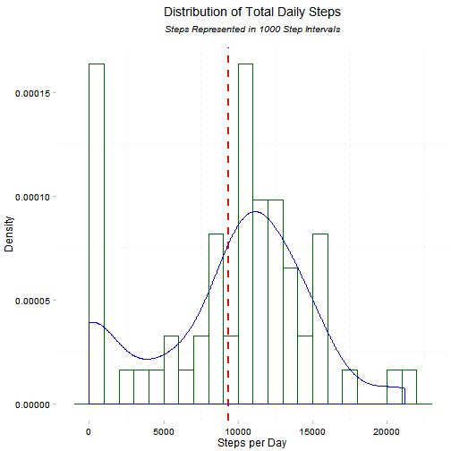
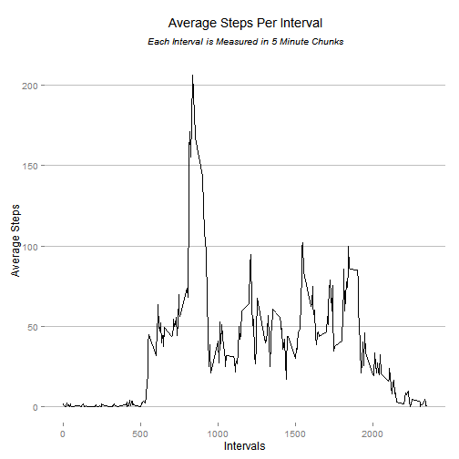
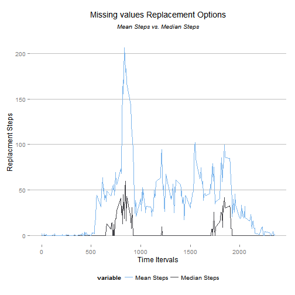
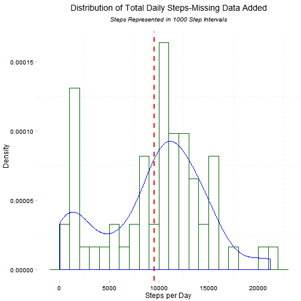
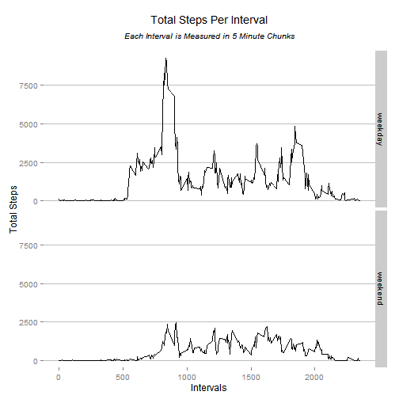

Load all the libraries that will be need for the analyis

```r
   library(dplyr)
   library(ggplot2)
   library(grid)
   library(chron)
   library(ggthemes)
```

```
## Warning: package 'ggthemes' was built under R version 3.1.3
```

## Loading and preprocessing the data


```r
# The data used for analysis should in the working directory load it
  working_dir <- getwd()
  data_file <- paste0(working_dir,"/activity.csv")
  if (!file.exists(data_file)) { # file dont exists load it
    URL <- "https://d396qusza40orc.cloudfront.net/repdata%2Fdata%2Factivity.zip"
    temp_file <- tempfile()
    download.file(URL, dest=temp_file) 
    unzip (temp_file, exdir = working_dir)
    unlink(temp_file)
  }
  #Load the data file
  acty_data <- read.csv(data_file)
```


## What is mean total number of steps taken per day?

The initial analysis was carried out to understand daily step activities of the participants whose data was collected. The first report was to get the total number of steps taken per day by the participants. The steps to get the data were:

* Original data placed in daily buckets

* The Sum, Mean and Median steps for each day were calculated and stored


```r
acty_date <- group_by(acty_data,date)
acty_date_sumry <- summarize(acty_date,
                             total_dly_steps = sum(steps, na.rm = TRUE),
                             mean_dly_steps = mean(steps, na.rm = TRUE),
                             median_dly_steps = median(steps, na.rm = TRUE)
                            )
```

The Visual representation of the distribution of total daily steps was created using a Histogram. 


```r
g1 <- ggplot(acty_date_sumry, aes(total_dly_steps))
g1 <- g1 + geom_histogram(binwidth = 1000,colour = "darkgreen",fill = "white")
g1 <- g1 + ggtitle(expression(atop("Total Daily Steps",
                              atop(italic("Steps Represented in 1000 Step Intervals"), ""))))
g1 <- g1 +labs(x="Steps Per Day",y="Count")
g1 <- g1 + theme_pander()
g1 <- g1 + scale_fill_pander()
print(g1)
```

 

The mean the mean and median of the total number of steps taken for each day that data was collected is reported bellow:

* The first Report is a table which shows the total, mean and median steps for each day

* The second Report Display the data in Graphical Format

#### Total, Mean and Median Steps for Each Day in the Study


```r
knitr::kable(acty_date_sumry, digits = 2, caption = "Total,Mean and Median Steps for Each Day.")
```


|date       | total_dly_steps| mean_dly_steps| median_dly_steps|
|:----------|---------------:|--------------:|----------------:|
|2012-10-01 |               0|            NaN|               NA|
|2012-10-02 |             126|           0.44|                0|
|2012-10-03 |           11352|          39.42|                0|
|2012-10-04 |           12116|          42.07|                0|
|2012-10-05 |           13294|          46.16|                0|
|2012-10-06 |           15420|          53.54|                0|
|2012-10-07 |           11015|          38.25|                0|
|2012-10-08 |               0|            NaN|               NA|
|2012-10-09 |           12811|          44.48|                0|
|2012-10-10 |            9900|          34.38|                0|
|2012-10-11 |           10304|          35.78|                0|
|2012-10-12 |           17382|          60.35|                0|
|2012-10-13 |           12426|          43.15|                0|
|2012-10-14 |           15098|          52.42|                0|
|2012-10-15 |           10139|          35.20|                0|
|2012-10-16 |           15084|          52.38|                0|
|2012-10-17 |           13452|          46.71|                0|
|2012-10-18 |           10056|          34.92|                0|
|2012-10-19 |           11829|          41.07|                0|
|2012-10-20 |           10395|          36.09|                0|
|2012-10-21 |            8821|          30.63|                0|
|2012-10-22 |           13460|          46.74|                0|
|2012-10-23 |            8918|          30.97|                0|
|2012-10-24 |            8355|          29.01|                0|
|2012-10-25 |            2492|           8.65|                0|
|2012-10-26 |            6778|          23.53|                0|
|2012-10-27 |           10119|          35.14|                0|
|2012-10-28 |           11458|          39.78|                0|
|2012-10-29 |            5018|          17.42|                0|
|2012-10-30 |            9819|          34.09|                0|
|2012-10-31 |           15414|          53.52|                0|
|2012-11-01 |               0|            NaN|               NA|
|2012-11-02 |           10600|          36.81|                0|
|2012-11-03 |           10571|          36.70|                0|
|2012-11-04 |               0|            NaN|               NA|
|2012-11-05 |           10439|          36.25|                0|
|2012-11-06 |            8334|          28.94|                0|
|2012-11-07 |           12883|          44.73|                0|
|2012-11-08 |            3219|          11.18|                0|
|2012-11-09 |               0|            NaN|               NA|
|2012-11-10 |               0|            NaN|               NA|
|2012-11-11 |           12608|          43.78|                0|
|2012-11-12 |           10765|          37.38|                0|
|2012-11-13 |            7336|          25.47|                0|
|2012-11-14 |               0|            NaN|               NA|
|2012-11-15 |              41|           0.14|                0|
|2012-11-16 |            5441|          18.89|                0|
|2012-11-17 |           14339|          49.79|                0|
|2012-11-18 |           15110|          52.47|                0|
|2012-11-19 |            8841|          30.70|                0|
|2012-11-20 |            4472|          15.53|                0|
|2012-11-21 |           12787|          44.40|                0|
|2012-11-22 |           20427|          70.93|                0|
|2012-11-23 |           21194|          73.59|                0|
|2012-11-24 |           14478|          50.27|                0|
|2012-11-25 |           11834|          41.09|                0|
|2012-11-26 |           11162|          38.76|                0|
|2012-11-27 |           13646|          47.38|                0|
|2012-11-28 |           10183|          35.36|                0|
|2012-11-29 |            7047|          24.47|                0|
|2012-11-30 |               0|            NaN|               NA|

#### Graphical Report of Steps in the Study

The second Report is a Graph that shows: 

* All the total steps

* Total steps relative to mean

* Density Distribution of the steps


```r
g2 <- ggplot(acty_date_sumry, aes(total_dly_steps))
g2 <- g2 + geom_histogram(binwidth = 1000,colour = "darkgreen",fill = "white",aes(y = ..density..))
g2 <- g2 + geom_vline(aes(xintercept=mean(total_dly_steps, na.rm=T)),
                      color="red", linetype="dashed", size=1)
g2 <- g2 + geom_density(color="blue")
g2 <- g2 + ggtitle(expression(atop("Distribution of Total Daily Steps",
                              atop(italic("Steps Represented in 1000 Step Intervals"), ""))))
g2 <- g2 +labs(x="Steps per Day",y="Density")
g2 <- g2 + theme_pander()
g2 <- g2 + scale_fill_pander()
print(g2)
```

 

## What is the average daily activity pattern?

First calculate the Figures for each 5 minuite Inteval


```r
acty_intvl <- group_by(acty_data,interval)
acty_intvl_sumry <- summarize(acty_intvl,
                              total_intvl_steps = sum(steps, na.rm = TRUE),
                              mean_intvl_steps = mean(steps, na.rm = TRUE),
                              median_intvl_steps = median(steps, na.rm = TRUE)
                            )
```

#### Graph of the average number of steps taken, averaged across all days for 5-minute interval


```r
g3 <- ggplot(acty_intvl_sumry , aes(x = interval, y = mean_intvl_steps))
g3 <- g3 + geom_line()
g3 <- g3 + ggtitle(expression(atop("Average Steps Per Interval", 
                              atop(italic("Each Interval is Measured in 5 Minute Chunks"), ""))))
g3 <- g3 + labs(x="Intervals",y="Average Steps")
g3 <- g3 + theme_hc()
g3 <- g3 + scale_colour_hc()
print(g3)
```

 

Determine which 5 Minute Interval had the higest average number of steps


```r
#sort the table so the 5 Minute Interval with the higest average of steps is in first row
   acty_intvl_sumry <- arrange(acty_intvl_sumry,desc(mean_intvl_steps))
# get and store the the 5 Minute Interval with the higest average of steps
   intv_max <- head(select(acty_intvl_sumry,interval),1)
# get and store the the the higest average of steps for a 5 minute interval
   intv_max_mean <- head(select(acty_intvl_sumry,mean_intvl_steps),1)
# write out the results to the screen using the `r <Variable>` notation
```

1. The 5 minute interval with the higest average number of steps is Interval **: 835 **.

2. The interval 835, has an average of **: 206 ** Steps.

## Imputing missing values

Some of the dates in study are missing values; this section of the analysis evaluates the scale of the issue and recommends various solutions to remedy the issue.

The first step in the section is to Calculate and report the total number of missing values in the dataset (i.e. the total number of rows with NAs)


```r
# Count the number of records that have NA in the Step field and store it in a vairable
  na_step_rec_cnt <- sum(is.na(acty_data))
# Get number of uniqe days in study   
  unq_days <- n_distinct(acty_data$date)
# Get number of uniqe intervals in study 
  unq_intvl <- n_distinct(acty_data$interval)
# write out the results to the screen using the `r <Variable>` notation
```

The number of records with missign steps counts is **: 2304 ** .

The strategy to fill in the missing steps values in the dataset had a single guiding principle:

* Select the options that changes the original data the least.

 + There were **: 61 ** unique days.

 + There were **: 288 ** unique intervals.

Since the count of unique intervals is higher that that of unique days; assigning measures using unique intervals instead of days should give more detailed allocations.

Two options were considered to fill in the missing values:

* Assign the mean steps per inverval to missing values

* Assign the median steps per inverval to missing values


```r
# Graph options to see which is best
g4 <- ggplot(acty_intvl_sumry, aes(x=interval, y = value, color = variable))  
g4 <- g4 + geom_line(aes(y = median_intvl_steps, col = "Median Steps")) 
g4 <- g4 + geom_line(aes(y = mean_intvl_steps, col = "Mean Steps"))
g4 <- g4 + ggtitle(expression(atop("Missing values Replacement Options",
                              atop(italic("Mean Steps vs. Median Steps"), ""))))
g4 <- g4 + labs(x="Time Itervals", y=expression("Replacment Steps")) 
g4 <- g4 + theme(legend.justification = 'top')
g4 <- g4 + theme_hc()
g4 <- g4 + scale_colour_hc()
print(g4)
```

 

A new dataset was created that was equal to the original dataset but with the missing data filled in with the median values for each 5 minute interval.


```r
# get number of rows in orginal data set
  org_row_cnt <- nrow(acty_data)
# Create new data,merg orignal data with data that has the median figures for each interval
# Merge the data sets using the interval field
  acty_mrge <- merge(acty_data,acty_intvl_sumry,by="interval")
# get number of rows in orginal data set
  new_row_cnt <- nrow(acty_mrge)
```

Sanity check, to ensure that no records were lost when creating the new data set:

1. The Old data set had **: 17568 ** rows. 

2. The new data set has **:  17568 ** rows.

Assign the missing step data in new data set with the median values for each 5 minute interval.


```r
# Get number of records with NA in the step field in before assignment 
  before_na_cnt <- count(acty_mrge,is.na(steps))
# Assing the missing values
   x <-  nrow(acty_mrge)
   for (i in 1:x) {
        if (is.na(acty_mrge$steps[i])) {
            if (!is.na(acty_mrge$median_intvl_steps[i])) {
                acty_mrge$steps[i] = acty_mrge$median_intvl_steps[i]
            } 
        }      
   }
# Get number of records with NA in the step field in before assignment 
  after_na_cnt <- count(acty_mrge,is.na(steps))
```

Sanity check, to ensure that assign process worked

Record count Before:  

```r
   before_na_cnt
```

```
## Source: local data frame [2 x 2]
## 
##   is.na(steps)     n
## 1        FALSE 15264
## 2         TRUE  2304
```

Record count After:

```r
   after_na_cnt
```

```
## Source: local data frame [1 x 2]
## 
##   is.na(steps)     n
## 1        FALSE 17568
```

Calculations were done to get for each day, the total number, the mean and median number of steps taken.


```r
   new_acty_dly <- group_by(acty_mrge,date)
   new_acty_dly_sumry <- summarize(new_acty_dly,
                                 total_dly_steps = sum(steps, na.rm = TRUE),
                                 mean_dly_steps = mean(steps, na.rm = TRUE),
                                 median_dly_steps = median(steps, na.rm = TRUE)
                               )
```

A histogram of the total number of steps taken after the missing values were added was created and compared with the original graph.

#####  New Graph with Missing Data Added


```r
g5 <- ggplot(new_acty_dly_sumry, aes(total_dly_steps))
g5 <- g5 + geom_histogram(binwidth = 1000,colour = "darkgreen",fill = "white",
                          aes(y = ..density..))
g5 <- g5 + geom_vline(aes(xintercept=mean(total_dly_steps, na.rm=T)),
                      color="red", linetype="dashed", size=1)
g5 <- g5 + geom_density(color="blue")
g5 <- g5 + ggtitle(expression(atop("Distribution of Total Daily Steps-Missing Data Added",
                                   atop(italic("Steps Represented in 1000 Step Intervals"), ""))))
g5 <- g5 +labs(x="Steps per Day",y="Density")
g5 <- g5 + theme_pander()
g5 <- g5 + scale_fill_pander()
print(g5)
```

 

##### Orginal Graph with Before Missing Data was Added


```r
print(g2)
```

 

Report the mean and median total number of steps taken per day (with missing values added).

To answer if the new values differ from the estimates from the first part of the assignment, And what the impact of imputing missing data on the estimates of the total daily number of steps, I did the following:

* Created a new data set with the old and new values

* Compared the original and new values


```r
# Create new data set that combines old and new by data
   comp_data <- merge(acty_date_sumry,new_acty_dly_sumry,by="date")
# Remove unwanted columns
   comp_data <- select(comp_data,-total_dly_steps.x,-total_dly_steps.y)
# Rename column to make them easier to understand
   comp_data <- rename(comp_data,original_mean = mean_dly_steps.x,
                                 new_mean = mean_dly_steps.y,
                                 original_median =median_dly_steps.x,
                                 new_median =  median_dly_steps.y)
```

##### Report on the changes


```r
   knitr::kable(comp_data, digits = 2, caption = "New and old Means and Medians Compared")
```


|date       | original_mean| original_median| new_mean| new_median|
|:----------|-------------:|---------------:|--------:|----------:|
|2012-10-01 |           NaN|              NA|     3.96|          0|
|2012-10-02 |          0.44|               0|     0.44|          0|
|2012-10-03 |         39.42|               0|    39.42|          0|
|2012-10-04 |         42.07|               0|    42.07|          0|
|2012-10-05 |         46.16|               0|    46.16|          0|
|2012-10-06 |         53.54|               0|    53.54|          0|
|2012-10-07 |         38.25|               0|    38.25|          0|
|2012-10-08 |           NaN|              NA|     3.96|          0|
|2012-10-09 |         44.48|               0|    44.48|          0|
|2012-10-10 |         34.38|               0|    34.38|          0|
|2012-10-11 |         35.78|               0|    35.78|          0|
|2012-10-12 |         60.35|               0|    60.35|          0|
|2012-10-13 |         43.15|               0|    43.15|          0|
|2012-10-14 |         52.42|               0|    52.42|          0|
|2012-10-15 |         35.20|               0|    35.20|          0|
|2012-10-16 |         52.38|               0|    52.38|          0|
|2012-10-17 |         46.71|               0|    46.71|          0|
|2012-10-18 |         34.92|               0|    34.92|          0|
|2012-10-19 |         41.07|               0|    41.07|          0|
|2012-10-20 |         36.09|               0|    36.09|          0|
|2012-10-21 |         30.63|               0|    30.63|          0|
|2012-10-22 |         46.74|               0|    46.74|          0|
|2012-10-23 |         30.97|               0|    30.97|          0|
|2012-10-24 |         29.01|               0|    29.01|          0|
|2012-10-25 |          8.65|               0|     8.65|          0|
|2012-10-26 |         23.53|               0|    23.53|          0|
|2012-10-27 |         35.14|               0|    35.14|          0|
|2012-10-28 |         39.78|               0|    39.78|          0|
|2012-10-29 |         17.42|               0|    17.42|          0|
|2012-10-30 |         34.09|               0|    34.09|          0|
|2012-10-31 |         53.52|               0|    53.52|          0|
|2012-11-01 |           NaN|              NA|     3.96|          0|
|2012-11-02 |         36.81|               0|    36.81|          0|
|2012-11-03 |         36.70|               0|    36.70|          0|
|2012-11-04 |           NaN|              NA|     3.96|          0|
|2012-11-05 |         36.25|               0|    36.25|          0|
|2012-11-06 |         28.94|               0|    28.94|          0|
|2012-11-07 |         44.73|               0|    44.73|          0|
|2012-11-08 |         11.18|               0|    11.18|          0|
|2012-11-09 |           NaN|              NA|     3.96|          0|
|2012-11-10 |           NaN|              NA|     3.96|          0|
|2012-11-11 |         43.78|               0|    43.78|          0|
|2012-11-12 |         37.38|               0|    37.38|          0|
|2012-11-13 |         25.47|               0|    25.47|          0|
|2012-11-14 |           NaN|              NA|     3.96|          0|
|2012-11-15 |          0.14|               0|     0.14|          0|
|2012-11-16 |         18.89|               0|    18.89|          0|
|2012-11-17 |         49.79|               0|    49.79|          0|
|2012-11-18 |         52.47|               0|    52.47|          0|
|2012-11-19 |         30.70|               0|    30.70|          0|
|2012-11-20 |         15.53|               0|    15.53|          0|
|2012-11-21 |         44.40|               0|    44.40|          0|
|2012-11-22 |         70.93|               0|    70.93|          0|
|2012-11-23 |         73.59|               0|    73.59|          0|
|2012-11-24 |         50.27|               0|    50.27|          0|
|2012-11-25 |         41.09|               0|    41.09|          0|
|2012-11-26 |         38.76|               0|    38.76|          0|
|2012-11-27 |         47.38|               0|    47.38|          0|
|2012-11-28 |         35.36|               0|    35.36|          0|
|2012-11-29 |         24.47|               0|    24.47|          0|
|2012-11-30 |           NaN|              NA|     3.96|          0|

* The mean and median figures for the dates that did not have missing data reamined the same.

* According the histogram The distribution the changes were in the first 2 thousand step intervals.
## Are there differences in activity patterns between weekdays and weekends?

To evalute if there are differences in activity patterns between weekdays and weekends?

* A new varaible day_type, that classified dates in the study as weekdays or weekends

* A summary of total steps by interval and day_type

* The results were graphed in a time series graph.


```r
# Add day type varaible to data set with missing values added
  acty_mrge <- mutate(acty_mrge,day_type=ifelse(is.weekend(date) == TRUE, "weekend", "weekday"))
# Summarize the steps by interval and day type
  type_intvl <- group_by(acty_mrge,day_type,interval)
  type_intvl_sumry <- summarize(type_intvl,total_intvl_steps = sum(steps))
# create the graph to help answer the question
g6 <- ggplot(type_intvl_sumry , aes(x = interval, y = total_intvl_steps))
g6 <- g6 + geom_line()
g6 <- g6 + facet_grid(day_type ~ .)
g6 <- g6 + ggtitle(expression(atop("Total Steps Per Interval", 
                              atop(italic("Each Interval is Measured in 5 Minute Chunks"), ""))))
g6 <- g6 + labs(x="Intervals",y="Total Steps")
g6 <- g6 + theme_hc()
g6 <- g6 + scale_colour_hc()
print(g6)
```

 

Yes, there are differences in activity patterns between weekdays and weekends. It apears that activity during the weekend is lower than during the week in both frequency and total amount of steps taken.
